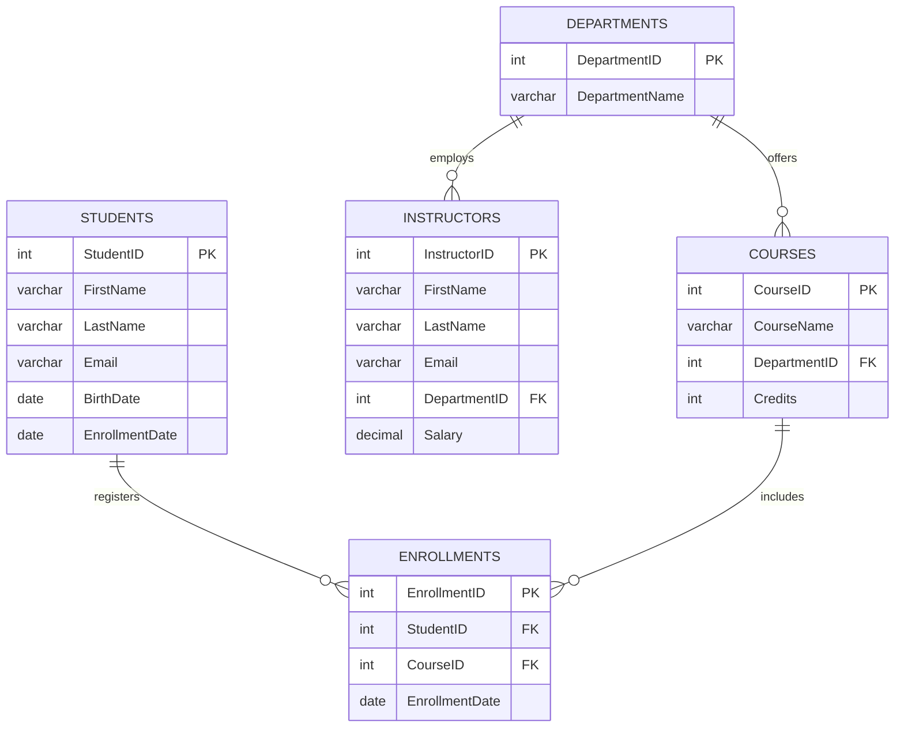

# 🎓 University Course Management System

[](https://www.mysql.com/)
[](https://en.wikipedia.org/wiki/SQL)
[](LICENSE)
[]()

A comprehensive relational database management project designed in **MySQL** to simulate academic administration in a university setting. This project covers everything from database design, normalized schema architecture, and foreign key constraints to CRUD operations, complex analytical subqueries, aggregate reporting, analytic window functions, and conditional data transformations.

---

## 📑 Table of Contents

- [Overview](#-overview)
- [Database Architecture & Schema](#-database-architecture--schema)
  - [Entity-Relationship (ER) Diagram](#entity-relationship-er-diagram)
  - [Data Dictionary](#data-dictionary)
- [Key Features & SQL Capabilities](#-key-features--sql-capabilities)
  - [1. Data Definition & Integrity (DDL)](#1-data-definition--integrity-ddl)
  - [2. CRUD Operations (DML)](#2-crud-operations-dml)
  - [3. Multi-Table Joins](#3-multi-table-joins)
  - [4. Aggregations & Grouping](#4-aggregations--grouping)
  - [5. Advanced Subqueries & Filtering](#5-advanced-subqueries--filtering)
  - [6. Window Functions & Analytics](#6-window-functions--analytics)
  - [7. String, Date & Conditional Logic](#7-string-date--conditional-logic)
- [Getting Started](#-getting-started)
  - [Prerequisites](#prerequisites)
  - [Installation & Execution](#installation--execution)
- [Sample Queries & Business Logic](#-sample-queries--business-logic)
- [Repository Structure](#-repository-structure)
- [Future Enhancements](#-future-enhancements)
- [Author & License](#-author--license)

---

## 📌 Overview

The **University Course Management System** solves common academic administrative tracking challenges by structuring information across five core entities: **Departments**, **Students**, **Courses**, **Instructors**, and **Enrollments**.

### Core Objectives
- **Relational Integrity**: Enforce strict referential constraints using Primary Keys and Foreign Keys.
- **Academic Administration**: Model real-world university processes like department allocations, course registrations, and faculty assignments.
- **Analytical Reporting**: Provide actionable academic insights (e.g., student course loads, faculty compensation across departments, enrollment trends, and academic standing).

---

## 🏗 Database Architecture & Schema

### Entity-Relationship (ER) Diagram



---

### Data Dictionary

#### 1. `Departments`
Stores academic departments that offer courses and employ instructors.
| Column | Data Type | Constraints | Description |
| :--- | :--- | :--- | :--- |
| `DepartmentID` | `INT` | `PRIMARY KEY` | Unique identifier for each department |
| `DepartmentName` | `VARCHAR(50)` | Not Null | Name of academic department (e.g., Computer Science) |

#### 2. `Students`
Contains student personal and enrollment records.
| Column | Data Type | Constraints | Description |
| :--- | :--- | :--- | :--- |
| `StudentID` | `INT` | `PRIMARY KEY` | Unique identifier for each student |
| `FirstName` | `VARCHAR(50)` | Not Null | Student's first name |
| `LastName` | `VARCHAR(50)` | Not Null | Student's last name |
| `Email` | `VARCHAR(100)` | Unique, Not Null | Institutional or personal email address |
| `BirthDate` | `DATE` | - | Date of birth |
| `EnrollmentDate` | `DATE` | Not Null | Date of university admission/matriculation |

#### 3. `Courses`
Maintains the catalog of academic courses offered.
| Column | Data Type | Constraints | Description |
| :--- | :--- | :--- | :--- |
| `CourseID` | `INT` | `PRIMARY KEY` | Unique identifier for each course |
| `CourseName` | `VARCHAR(100)` | Not Null | Full title of the course |
| `DepartmentID` | `INT` | `FOREIGN KEY` | References `Departments(DepartmentID)` |
| `Credits` | `INT` | Not Null | Number of credit hours assigned |

#### 4. `Instructors`
Holds faculty information, department affiliations, and salary data.
| Column | Data Type | Constraints | Description |
| :--- | :--- | :--- | :--- |
| `InstructorID` | `INT` | `PRIMARY KEY` | Unique identifier for each instructor |
| `FirstName` | `VARCHAR(50)` | Not Null | Instructor's first name |
| `LastName` | `VARCHAR(50)` | Not Null | Instructor's last name |
| `Email` | `VARCHAR(100)` | Unique, Not Null | University email address |
| `DepartmentID` | `INT` | `FOREIGN KEY` | References `Departments(DepartmentID)` |
| `Salary` | `DECIMAL(10,2)`| Not Null | Faculty annual compensation |

#### 5. `Enrollments`
Represents the many-to-many relationship between Students and Courses.
| Column | Data Type | Constraints | Description |
| :--- | :--- | :--- | :--- |
| `EnrollmentID` | `INT` | `PRIMARY KEY` | Unique identifier for each enrollment event |
| `StudentID` | `INT` | `FOREIGN KEY` | References `Students(StudentID)` |
| `CourseID` | `INT` | `FOREIGN KEY` | References `Courses(CourseID)` |
| `EnrollmentDate` | `DATE` | Not Null | Date when course registration occurred |

---

## ⚡ Key Features & SQL Capabilities

### 1. Data Definition & Integrity (DDL)
- **Primary & Foreign Key Constraints**: Enforces parent-child relationships between departments, courses, instructors, and enrollments.
- **Graceful Creation**: Uses `CREATE DATABASE IF NOT EXISTS` for idempotent setup.

### 2. CRUD Operations (DML)
- **Insert**: Populates records across all relational tables.
- **Select**: Retrieves single and multiple entities with specific projections.
- **Update**: Modifies attributes such as student emails, department names, course credit hours, and instructor department reassignments.
- **Delete**: Safely removes temporary and test records.

### 3. Multi-Table Joins
- **Inner Joins**: Merges `Students`, `Enrollments`, and `Courses` to reveal active course participants.
- **Left Joins**: Identifies all students, including those not currently enrolled in any course.

### 4. Aggregations & Grouping
- **Summary Metrics**: Calculates average course credits (`AVG`) and maximum instructor salary per department (`MAX`).
- **Grouped Totals**: Computes total enrollments per department and course.
- **Threshold Filtering**: Utilizes `HAVING` clauses to filter groups with specific enrollment volumes (`HAVING COUNT(StudentID) > 5`).

### 5. Advanced Subqueries & Filtering
- **Set Intersections**: Identifies students concurrently enrolled in multiple specific courses (e.g., *'Introduction to SQL'* AND *'Data Structures'*).
- **Nested Subqueries**: Filters students enrolled in high-capacity courses (>10 students).

### 6. Window Functions & Analytics
- **Running Totals**: Implements `COUNT(*) OVER (ORDER BY EnrollmentDate)` to compute cumulative enrollment trajectories over time.

### 7. String, Date & Conditional Logic
- **String Manipulation**: Generates instructor full names via `CONCAT(FirstName, ' ', LastName)`.
- **Date Extraction & Arithmetic**: Extracts matriculation years with `YEAR(EnrollmentDate)` and calculates seniority using `DATE_SUB(CURDATE(), INTERVAL 4 YEAR)`.
- **Conditional Categorization**: Implements `CASE WHEN ... THEN ... ELSE ... END` to dynamically tag students as `Senior` or `Junior`.

---

## 🚀 Getting Started

### Prerequisites
- **MySQL Server** (version 8.0 or higher recommended)
- **Database Client**: Any SQL client such as [MySQL Workbench](https://www.mysql.com/products/workbench/), [DBeaver](https://dbeaver.io/), [DataGrip](https://www.jetbrains.com/datagrip/), or the MySQL Command Line Interface (CLI).

### Installation & Execution

1. **Clone the Repository**:
   ```bash
   git clone https://github.com/your-username/university-course-management.git
   cd university-course-management
   ```

2. **Execute the SQL Script**:

   - **Using MySQL CLI**:
     ```bash
     mysql -u your_username -p < "final project.sql"
     ```

   - **Using MySQL Workbench / GUI**:
     1. Launch MySQL Workbench and connect to your database instance.
     2. Navigate to **File** > **Open SQL Script...** and select `final project.sql`.
     3. Click the ⚡ **Execute** button (or press `Ctrl + Shift + Enter`).
     4. Refresh the **Schemas** panel to explore `university_course_management`.

---

## 💡 Sample Queries & Business Logic

<details>
<summary><b>🔍 1. Running Total of Enrollments (Window Function)</b></summary>

Calculates a cumulative count of enrolled students ordered by registration date:

```sql
SELECT 
    EnrollmentID, 
    StudentID, 
    CourseID, 
    EnrollmentDate,
    COUNT(*) OVER (ORDER BY EnrollmentDate) AS running_total_students
FROM Enrollments;
```
</details>

<details>
<summary><b>🏷️ 2. Dynamic Student Classification (CASE Statement)</b></summary>

Classifies students as `Senior` or `Junior` based on whether they enrolled 4 or more years ago:

```sql
SELECT 
    StudentID, 
    FirstName, 
    LastName, 
    EnrollmentDate,
    CASE
        WHEN EnrollmentDate <= DATE_SUB(CURDATE(), INTERVAL 4 YEAR) THEN 'Senior'
        ELSE 'Junior'
    END AS StudentLabel
FROM Students;
```
</details>

<details>
<summary><b>📚 3. Students Enrolled in Both SQL & Data Structures (Subquery Intersection)</b></summary>

Finds students who are registered in both prerequisite courses:

```sql
SELECT s.*
FROM Students s
WHERE s.StudentID IN (
    SELECT e.StudentID 
    FROM Enrollments e
    JOIN Courses c ON e.CourseID = c.CourseID
    WHERE c.CourseName = 'Introduction to SQL'
)
AND s.StudentID IN (
    SELECT e.StudentID 
    FROM Enrollments e
    JOIN Courses c ON e.CourseID = c.CourseID
    WHERE c.CourseName = 'Data Structures'
);
```
</details>

<details>
<summary><b>📊 4. Total Enrollments by Academic Department</b></summary>

Aggregates student registrations grouped by department:

```sql
SELECT 
    d.DepartmentName, 
    COUNT(e.StudentID) AS student_count
FROM Departments d
JOIN Courses c ON d.DepartmentID = c.DepartmentID
JOIN Enrollments e ON c.CourseID = e.CourseID
GROUP BY d.DepartmentName;
```
</details>

---

## 📁 Repository Structure

```text
├── final project.sql       # Complete SQL script (DDL, DML, CRUD & Analytical Queries)
├── README.md               # Project documentation and guide
└── LICENSE                 # Project license (MIT)
```

---

## 🔮 Future Enhancements

- [ ] **Indexes**: Add `INDEX` on frequently filtered columns (`EnrollmentDate`, `DepartmentID`, `CourseID`) for query optimization.
- [ ] **Triggers**: Implement automated triggers to prevent course over-enrollment beyond class capacity.
- [ ] **Stored Procedures**: Create reusable stored procedures for student registration and transcript generation.
- [ ] **Views**: Create reporting views for department-level analytics and GPA calculations.

---

##  License

- **License**: This project is licensed under the [MIT License](LICENSE) - feel free to use and adapt it for learning and academic projects.
